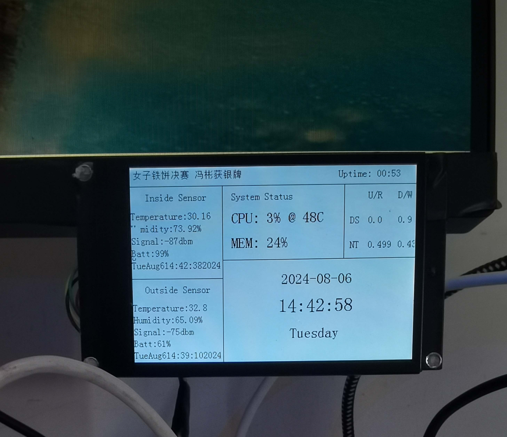

# subscreen


一个小屏幕（JC035-HVGA-ST-02-V02），整理杂物时发现的，废物利用一下当作一个小副屏

just doing a code backup :)

```shell
Sub Screen Controller

Usage:
  sscreen [command]

Available Commands:
  completion  Generate the autocompletion script for the specified shell
  help        Help about any command
  off         Stop Application
  on          Start Application
  set         Set something
    - light       Set brightness
  test        Test

Flags:
  -h, --help   help for sscreen

Use "sscreen [command] --help" for more information about a command.
```

<video src="https://github.com/user-attachments/assets/b527fa57-bdd5-4132-ae29-5de4d9bc76a3"></video>


